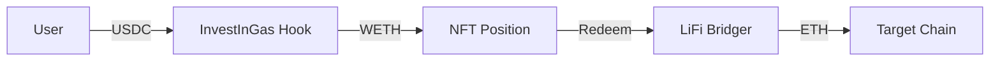

# InvestInGas - ETH-Native Gas Futures

InvestInGas is a decentralized application that enables users to hedge against Ethereum gas price volatility. Built as a Uniswap v4 Hook, it allows users to purchase "Gas Positions" - NFT-represented futures contracts that lock in a specific gas price.

## Architecture

The system consists of two primary contracts:

*   **`InvestInGasHook`**: A Uniswap v4 hook that manages the purchase logic. Users swap USDC for WETH, which is then locked into a gas position.
*   **`LiFiBridger`**: A helper contract that leverages LiFi (LI.FI) to bridge assets (ETH) to other chains when a user redeems their position.



## Contracts (`src/`)

### `InvestInGasHook.sol`
The core logic of the protocol, implemented as a Uniswap v4 Hook.
- **Position Management**: Mints ERC721 tokens (`IIGPOS`) representing gas positions.
- **Swap Integration**: Uses the Uniswap v4 `unlock` pattern to swap USDC for WETH gas-efficiently.
- **Redemption**: Orchestrates redemptions, either locally on Sepolia or cross-chain via the `LiFiBridger`.
- **Expiry Logic**: Users can claim a refund of their WETH (minus a small fee) if their position expires without being used.
- **Fees**: Manages protocol fees (50 bps) and expiry refund fees (200 bps).

### `LiFiBridger.sol`
A dedicated helper for cross-chain asset movement.
- **LiFi Integration**: Interacts with the LiFi Diamond to bridge ETH to various destination chains.
- **WETH Handling**: Automatically unwraps WETH to native ETH before bridging or local transfer.
- **Direct Transfers**: Handles "redemptions" to the same chain (Sepolia) by simply unwrapping and sending ETH.

## Scripts (`script/`)

### `DeployInvestInGas.s.sol`
The primary deployment script for the protocol.
- **Hook Mining**: Uses `HookMiner` to find a CREATE2 salt that results in a hook address with the correct Uniswap v4 flags (beforeSwap, afterSwap).
- **Setup**: Deploys both `InvestInGasHook` and `LiFiBridger`, links them together, and sets the default `PoolKey`.
- **Initialization**: Automatically initializes the pool with a default price (approx. Tick 38698) to ensure swaps are immediately functional.

### `AddLiquidity.s.sol`
A complex script to add liquidity to the Uniswap v4 pool.
- **LiquidityHelper**: Deploys a temporary helper contract to handle the Uniswap v4 `unlockCallback`.
- **Target Tier**: Currently configured for the **0.30% fee tier** (3000 fee, 60 tick spacing).
- **Position Setup**: Adds concentrated liquidity around the active price.

### `CheckPoolState.s.sol`
A diagnostic utility to check the current price and liquidity across multiple pool tiers (0.3%, 0.05%, 1.0%). Use this to verify if a pool is "healthy" before attempting a purchase.

### `AlignExistingHook.s.sol`
A migration utility used to update an already-deployed hook's `poolKey` to a new fee tier without redeploying the entire contract.

## Supported Chains

| Chain | Type | Chain ID |
|-------|------|----------|
| **Sepolia** | Deployment Network | 11155111 |
| **Arbitrum Sepolia** | Cross-chain destination | 421614 |
| **Base Sepolia** | Cross-chain destination | 84532 |
| **Polygon Amoy** | Cross-chain destination | 80002 |
| **Optimism Sepolia** | Cross-chain destination | 11155420 |

## Uniswap v4 Pool Setup

The system is optimized for the following pool configuration:
- **Pair**: `USDC` / `WETH`
- **Fee Tier**: `3000` (0.30%)
- **Tick Spacing**: `60`
- **Hook Flags**: `BEFORE_SWAP` | `AFTER_SWAP`

**Warning**: Swaps will revert with `PriceLimitAlreadyExceeded` if the pool is uninitialized or has zero liquidity at the target price range. Use `CheckPoolState.s.sol` to verify.

## Getting Started

### Prerequisites

Ensure you have the following installed:

*   **Foundry**: `curl -L https://foundry.paradigm.xyz | bash`
*   **Git**: `sudo apt install git` (or equivalent)

### Installation

1.  Clone the repository:
    ```bash
    git clone https://github.com/InvestInGas/v4-contracts.git
    cd v4-contracts
    ```

2.  Install dependencies:
    ```bash
    forge install
    ```

3.  Build the project:
    ```bash
    forge build
    ```

## Configuration

Duplicate the `.env` template and configure your secrets:

```bash
cp .env.example .env
```

**Required Variables:**
*   `PRIVATE_KEY`: Your wallet private key (without `0x`). **Keep this secret!**
*   `SEPOLIA_RPC`: RPC URL for Sepolia (e.g., from Alchemy or Infura).

**Optional Variables:**
*   `ETHERSCAN_API_KEY`: For automatic contract verification.
*   `RELAYER_ADDRESS`: Address of the relayer (defaults to deployer if unset).

## Deployment Guide

We use a Foundry script to securely deploy and configure both contracts.

### 1. Deploy to Sepolia

Run the following command to deploy, broadcast, and verify:

```bash
source .env && forge script script/DeployInvestInGas.s.sol \
  --rpc-url $SEPOLIA_RPC \
  --broadcast \
  --verify \
  --etherscan-api-key $ETHERSCAN_API_KEY
```

### 2. Verify Output

On success, the script will output the deployed addresses:

```text
=== Deployment Summary ===
InvestInGasHook: 0x...
LiFiBridger: 0x...
```

**Important**: Save these addresses for your configuration.