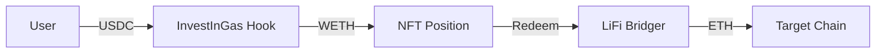

# InvestInGas - ETH-Native Gas Futures

InvestInGas is a decentralized application that enables users to hedge against Ethereum gas price volatility. Built as a Uniswap v4 Hook, it allows users to purchase "Gas Positions" - NFT-represented futures contracts that lock in a specific gas price.

## Architecture

The system consists of two primary contracts:

*   **`InvestInGasHook`**: A Uniswap v4 hook that manages the purchase logic. Users swap USDC for WETH, which is then locked into a gas position.
*   **`LiFiBridger`**: A helper contract that leverages LiFi (LI.FI) to bridge assets (ETH) to other chains when a user redeems their position.



## Supported Chains

| Chain | Type |
|-------|------|
| **Sepolia** | Deployment Network & Same-chain usage |
| **Arbitrum Sepolia** | Cross-chain destination |
| **Base Sepolia** | Cross-chain destination |
| **Polygon Amoy** | Cross-chain destination |

## Getting Started

### Prerequisites

Ensure you have the following installed:

*   **Foundry**: `curl -L https://foundry.paradigm.xyz | bash`
*   **Git**: `sudo apt install git` (or equivalent)

### Installation

1.  Clone the repository:
    ```bash
    git clone https://github.com/InvestInGas/v4-contracts.git
    cd v4-contracts
    ```

2.  Install dependencies:
    ```bash
    forge install
    ```

3.  Build the project:
    ```bash
    forge build
    ```

## Configuration

Duplicate the `.env` template and configure your secrets:

```bash
cp .env.example .env
```

**Required Variables:**
*   `PRIVATE_KEY`: Your wallet private key (without `0x`). **Keep this secret!**
*   `SEPOLIA_RPC`: RPC URL for Sepolia (e.g., from Alchemy or Infura).

**Optional Variables:**
*   `ETHERSCAN_API_KEY`: For automatic contract verification.
*   `RELAYER_ADDRESS`: Address of the relayer (defaults to deployer if unset).

## Deployment Guide

We use a Foundry script to securely deploy and configure both contracts.

### 1. Deploy to Sepolia

Run the following command to deploy, broadcast, and verify:

```bash
source .env && forge script script/DeployInvestInGas.s.sol \
  --rpc-url $SEPOLIA_RPC \
  --broadcast \
  --verify \
  --etherscan-api-key $ETHERSCAN_API_KEY
```

### 2. Verify Output

On success, the script will output the deployed addresses:

```text
=== Deployment Summary ===
InvestInGasHook: 0x...
LiFiBridger: 0x...
```

**Important**: Save these addresses for your frontend configuration.

